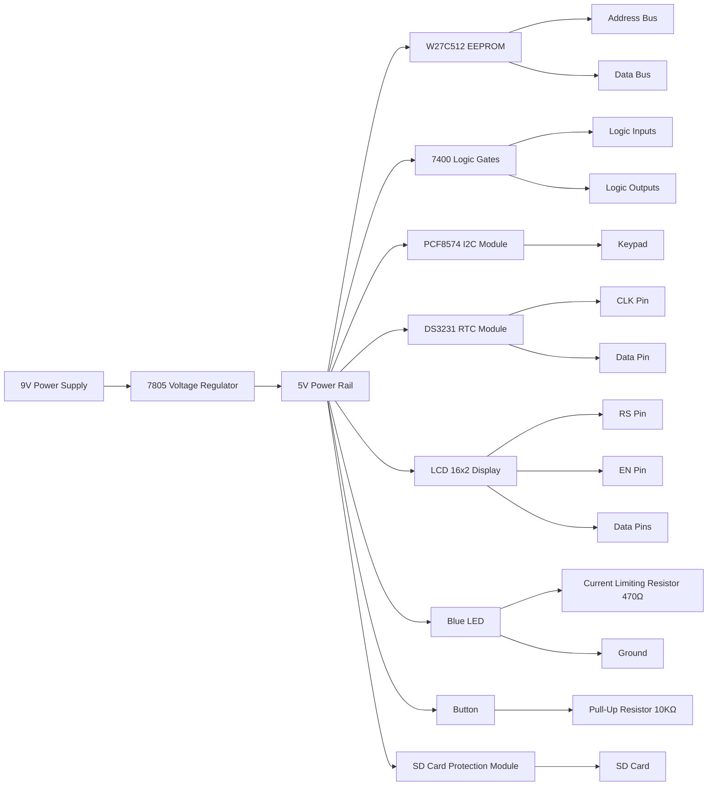

# 65b02
A homebrew breadboard computer based on the [W65C02S](https://www.westerndesigncenter.com/wdc/documentation/w65c02s.pdf) chip.

## Summary of Components

| Component              | Description                          | Use in Project                     | Link                                                                        |
|------------------------|--------------------------------------|------------------------------------|-----------------------------------------------------------------------------|
| W27C512 EEPROM         | 512K-bit EEPROM (64KB)               | Store firmware                     | [W27C512](https://seli.tn/product/w27c512-ci-eeprom-512k-bit-45ns-dip28/)   |
| 7805 Regulator         | 5V Voltage Regulator                 | Power supply                       | [7805](https://seli.tn/product/regulateur-de-tension-7805/)                 |
| 4MHz Quartz Oscillator | 4 Mhz Crystal Oscillator             | Clock signal for 65C02             | [4Mhz Oscillator](https://seli.tn/product/oscillateur-quartz-4mhz/)         |
| 74HC00 NAND Gate       | Quad 2-input NAND gate               | Address decoding                   | [74HC00](https://seli.tn/product/7400-ci-4-portes-logiques-non-et/)         |
| PCF8574T I2C Module    | I2C I/O Expander                     | Simplify peripheral interfacing    | [PCF8574T](https://seli.tn/product/pcf8574t-module-i2c-pour-clavier/)       |
| 16x2 LCD Display       | LCD Display                          | Program output                     | [16x02 LCD](https://seli.tn/product/afficheur-lcd/)                         |    
| RTC DS3231             | Real Time Clock                      | Time gathering                     | [DS3231](https://seli.tn/product/module-horloge-temps-reel/)                |
| SD Card Breakout       | SD Card reader                       | Read program                       | [SD Module](https://seli.tn/product/module-de-protection-carte-memoire-sd/) |
| Button                 |                                      | Get user input                     | [Button](https://seli.tn/product/bouton-tactil-6x6x17mm/)                   |
| Info LED               | Indicator                            | System On/Off                      | [Blue LED](https://seli.tn/product/led-5mm-bleu/)                           |
 
## Toolchain 

The [cc65](https://cc65.github.io) toolchain is utilized for this project.
| Program               | Description                          |
|-----------------------|--------------------------------------|
| cc65                  | C Compiler                           |
| ca65                  | Assembler                            |
| cl65                  | Linker                               |
| sim65                 | Emulator                             |

## Hardware

> [!IMPORTANT]  
> This project is currently under development. The components and chips have not been purchased yet.

The following is the electric diagram :

## Software Development

As a developer for this "platform", you can refer to the [Developer Manual](/docs/Developer%20Manual.md), which contains the datasheet, tips, and development options.
