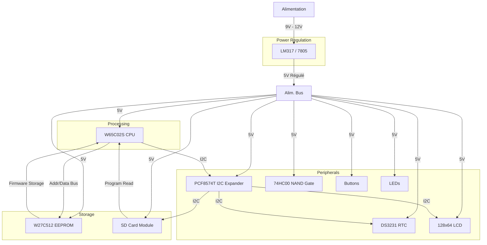

# 65b02
A homebrew breadboard computer based on the [W65C02S](https://www.westerndesigncenter.com/wdc/documentation/w65c02s.pdf) chip.

## Summary of Components
| Component              | Description                          | Use in Project                     | Link                               
|------------------------|--------------------------------------|------------------------------------|-----------------------------------------------------------------------------|
| W27C512 EEPROM         | 512K-bit EEPROM (64KB)               | Store firmware                     | [W27C512](https://seli.tn/product/w27c512-ci-eeprom-512k-bit-45ns-dip28/)   |
| 7805 Regulator         | 5V Voltage Regulator                 | Power supply                       | [7805](https://seli.tn/product/regulateur-de-tension-7805/)                 |
| 4MHz Quartz Oscillator | 4 Mhz Crystal Oscillator             | Clock signal for 65C02             | [4Mhz Oscillator](https://seli.tn/product/oscillateur-quartz-4mhz/)         |
| 74HC00 NAND Gate       | Quad 2-input NAND gate               | Address decoding                   | [74HC00](https://seli.tn/product/7400-ci-4-portes-logiques-non-et/)         |
| PCF8574T I2C Module    | I2C I/O Expander                     | Simplify peripheral interfacing    | [PCF8574T](https://seli.tn/product/pcf8574t-module-i2c-pour-clavier/)       |
| 16x2 LCD Display       | LCD Display                          | Program output                     | [128x64 LCD](https://seli.tn/product/afficheur-lcd-128x64-points-5v-avec-retroeclairage-port-parallele-st/) |    
| RTC DS3231             | Real Time Clock                      | Time gathering                     | [DS3231](https://seli.tn/product/module-horloge-temps-reel/)                |
| SD Card Breakout       | SD Card reader                       | Read program                       | [SD Module](https://seli.tn/product/module-de-protection-carte-memoire-sd/) |
| Button                 |                                      | Get user input                     | [Button](https://seli.tn/product/bouton-tactil-6x6x17mm/)                   |
| Info LED               | Indicator                            | System On/Off                      | [Blue LED](https://seli.tn/product/led-5mm-bleu/)                           |
| 10kOHM Resistor        | Resistance                           | Pull Up/Downs                      | [10kOHM Resistance](https://seli.tn/product/jeu-de-10-resistances-1-4w-4/?attribute_valeur=10KOHM)
| 220 Ohm Resistor       | LED Resistance                       | Limit LED voltage                  | [220 Ohm Resistance](https://seli.tn/product/jeu-de-10-resistances-1-4w-7/?attribute_valeur=220OHM) |
| 10 µF capacitor        | Electrolyte Capacitor                | Filter Alim.                       | [10 UF Capacitor](https://seli.tn/product/condensateur-radial-chimique-10uf/?attribute_tension=16V) |
| M/M Jumper Wire        |                                      |                                    | [10 Jumper Wires](https://seli.tn/product/jeu-de-10-fils-de-connexion-m-m-20cm-pour-arduino/)       |
| M/F Jumper Wire        |                                      |                                    | [10 Jumper Wires](https://seli.tn/product/jeu-de-10-fils-de-connexion-m-f-20cm-pour-arduino/)       |
 
## Hardware
> [!IMPORTANT]  
> This project is currently under development. The components and chips have not been purchased yet.

The following is the electric diagram :

## Manual
Refer to the [Developer Manual](/docs/Developer%20Manual.md) for information, including the datasheet, development guidelines and additional tips.
